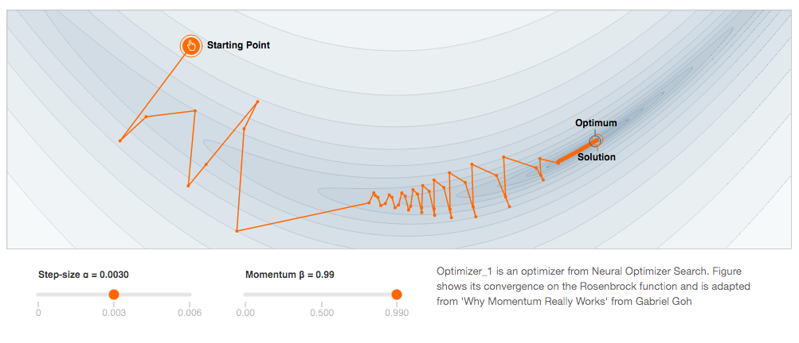
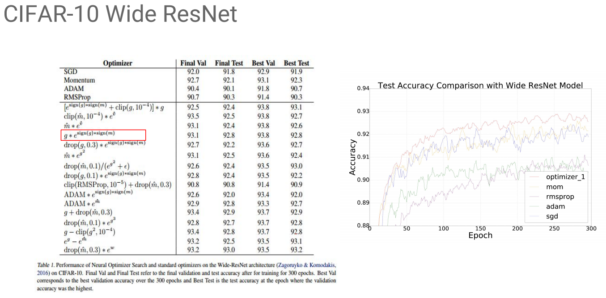

# Neural Optimizer Search - Optimizer_1

PyTorch implementation of Neural Optimizer Search's Optimizer_1

<p align="center"></p>

## Usage

Import _Optimizer_1_ like any torch.optim Optimizer:

```python
from optimizer_1 import Optimizer_1

optimizer = Optimizer_1(model.parameters(), lr=1e-3, momentum=0.99)
loss.backward()
optimizer.step()
```

--------------------------------------------------------------------------------

## Results

<p align="center"></p>

--------------------------------------------------------------------------------

## Own results

### MNIST (PyTorch/examples)

_Optimizer_1_
Test set: Average loss: 0.0525, Accuracy: 9820/10000 (98%)

_SGD with Momentum_
Test set: Average loss: 0.0542, Accuracy: 9825/10000 (98%)    

### VAE (PyTorch/examples) 

_Optimizer_1_
Test set: Average loss: 111.2389

_Adam_
Test set: Average loss: 105.5995